# Bala ES

**AI & ML Student · Full-Stack Developer**

Building practical web applications and exploring the space where software, AI and creative technology meet.

[Portfolio](https://balamurugan-portfolio-topaz.vercel.app) · [LinkedIn](https://www.linkedin.com/in/bala-es-18572437b) · [Instagram](https://www.instagram.com/___balzz/) · [Email](mailto:b757pu@gmail.com)

  

---

## About

- Based in **Chennai, India**
- Pursuing **B.Tech CSE with Artificial Intelligence & Machine Learning** at **SRM Institute of Science and Technology, Ramapuram**
- Currently building **full-stack and AI-powered projects**
- Learning **NumPy, Pandas and OpenCV**
- Interested in **hackathons, open source and product-focused development**

## Toolbox

### Core stack

| Area | Technologies |
| --- | --- |
| Languages | JavaScript · Java · Python · HTML · CSS |
| Frontend | React |
| Backend | Node.js |
| Data & services | Firebase · MySQL |
| AI / ML | NumPy · Pandas · OpenCV |
| Tools | Git · GitHub · VS Code · Figma · Canva |

## What I'm working toward

I like taking an idea from a rough concept to something people can actually use. My current focus is strengthening full-stack development while gradually bringing AI and computer-vision capabilities into my projects.

## Collaboration

Open to **hackathons, open-source contributions, web applications and AI projects**. If you're building something useful and want another developer at the table, feel free to reach out.

## Selected Projects

A few areas I’m actively building and exploring.

| Project | Focus |
| --- | --- |
| **Portfolio** | Personal portfolio for projects, skills and creative work. |
| **AI / ML Projects** | Practical experiments with Python, computer vision and data tools. |
| **Full-Stack Applications** | Web applications built with React, Node.js, Firebase and MySQL. |

More work is available across my GitHub repositories.

## GitHub activity

<!-- Static cards generated by GitHub Actions can be placed here when the stats workflow is enabled. -->

<picture>
  <source media="(prefers-color-scheme: dark)" srcset="https://raw.githubusercontent.com/Bala-codes757/Bala-codes757/output/github-snake-dark.svg">
  <source media="(prefers-color-scheme: light)" srcset="https://raw.githubusercontent.com/Bala-codes757/Bala-codes757/output/github-snake.svg">
  
</picture>

## Connect

Building · Learning · Shipping

